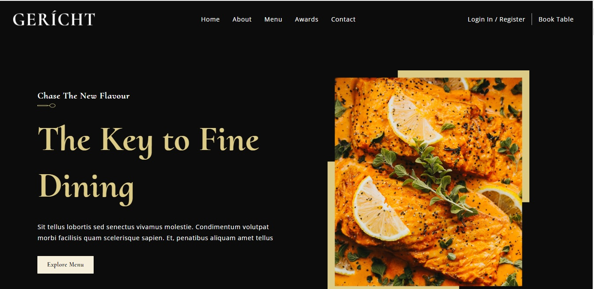
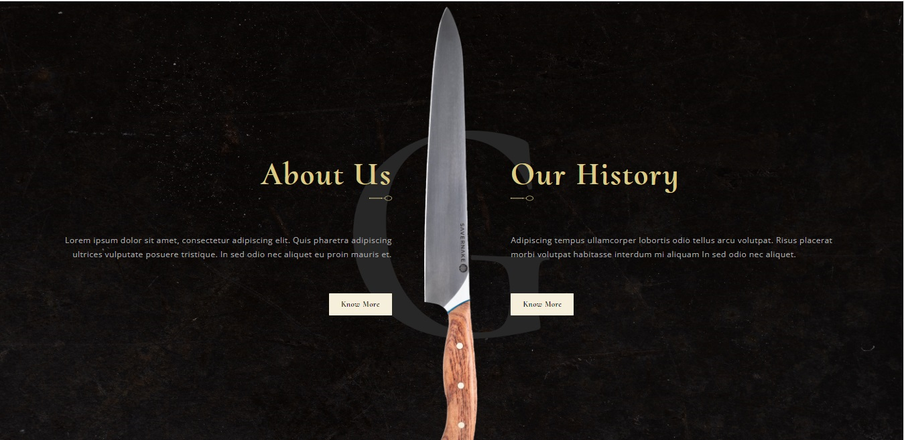
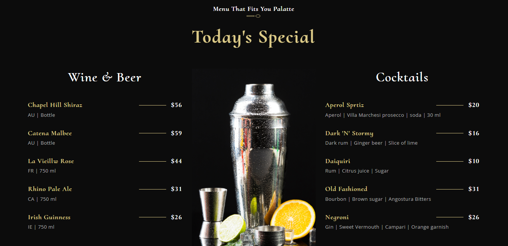
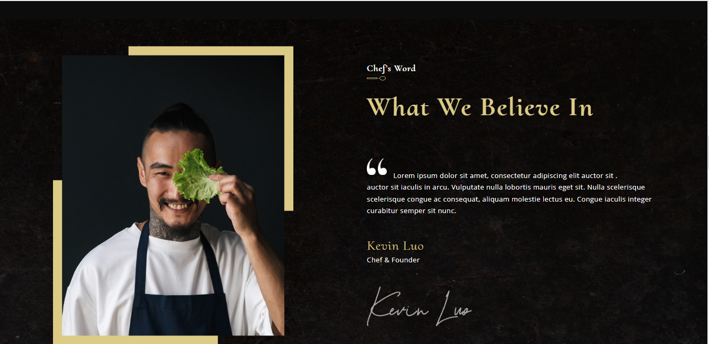
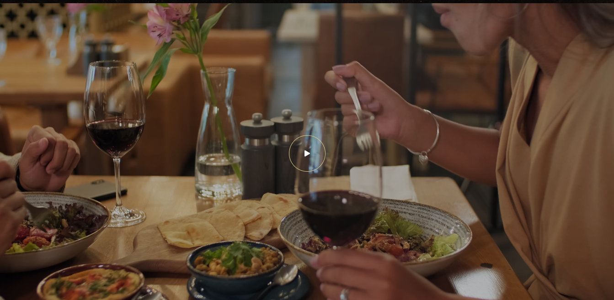
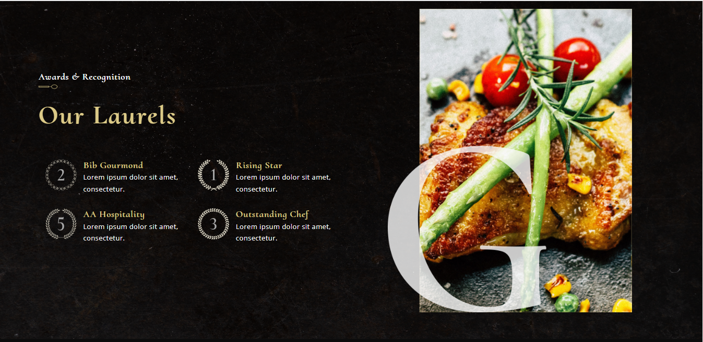
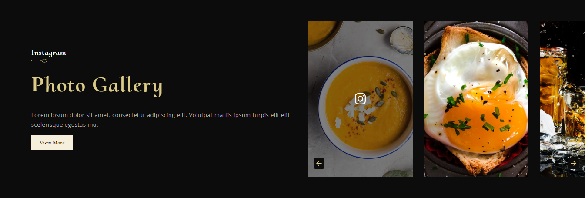
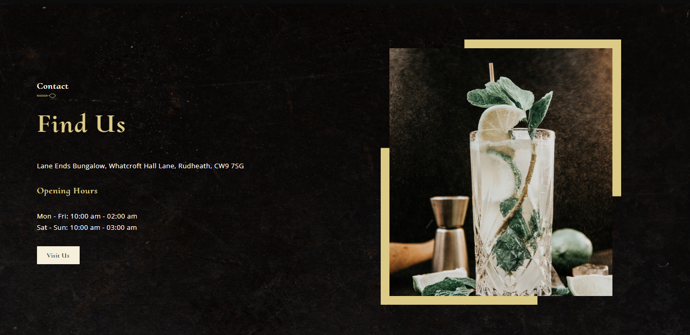
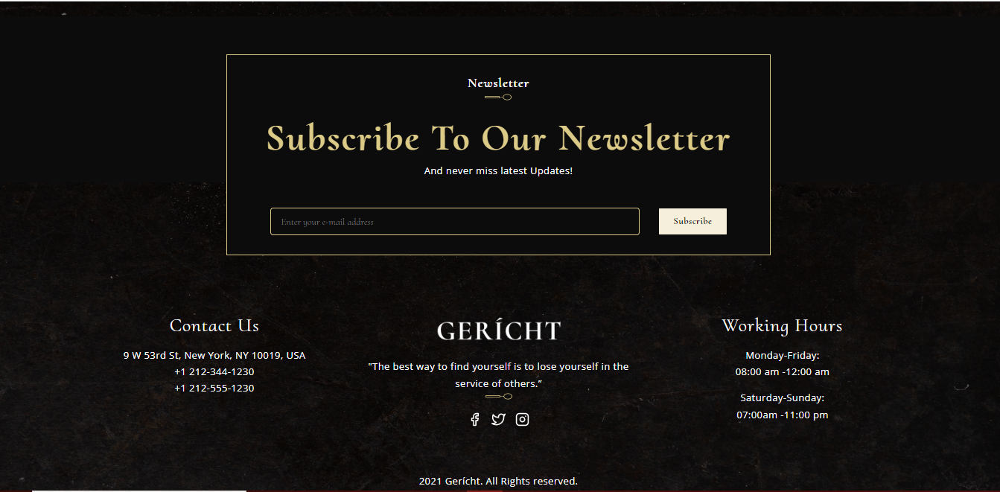

## React_Responsive_Restaurant_Website 

You can view the site here
[Click Me](https://era-responsive-restaurant-website.netlify.app/)

## Table of Contents

- [About](#about)
- [Technologies used](#technologies-used)
- [Features](#features)
- [Author](#author)

## About
 - Transform a Figma design into a fully functioning modern responsive restaurant website.
   
## Technologies used
- ReactJS
- CSS BEM Model
- Figma

## Features
<ul>
  <li>Home</li>
  <li>About</li>
  <li>Menu</li>
  <li>Awards</li>
  <li>Contact</li>
</ul>

## Author

Ramadan Emin

